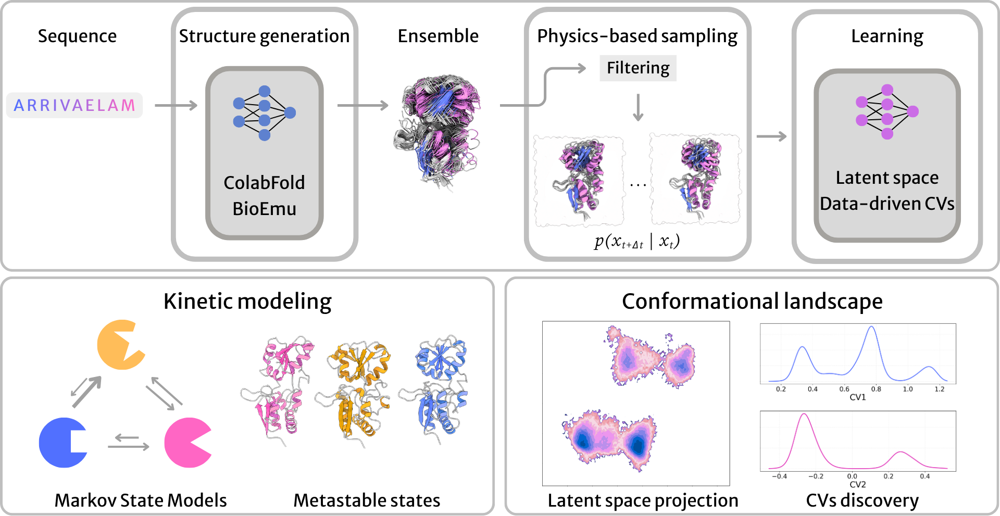

# StateScape



StateScape is an open-source Python package for exploring protein conformational landscapes. Starting from a sequence, structure, or existing MD ensemble, it integrates AI-driven structure generation, physics-based sampling, and unsupervised learning into a single modular workflow.

---

## Installation

First, clone the repository:

```bash
git clone https://github.com/esalinasbio/statescape.git
cd statescape
```

Then install in a separate python environment: 

```bash
pip install -e .
```

---

## What it does

1. **Ensemble generation** — interfaces to ColabFold (rMSA-AF2) and BioEmu for generating diverse structural ensembles. Any external source (AlphaFlow, existing MD trajectories, etc.) is also accepted as standard structure files.

2. **Filtering and conformer selection** — filter by RMSD, TM-score, pLDDT, peptide  bond geometry, and steric clashes. A mask-based API allows custom user-defined filters. Featurize, reduce dimensionality (PCA or UMAP), and cluster (k-means, GMM, or regular-space) to select representative seeds.

3. **MD simulation** — minimal-setup orchestration of AMBER or OpenMM simulations across all selected seeds.

4. **Featurization and feature selection** — backbone/sidechain dihedrals, pairwise distances, or coordinates. Automatic feature selection via AMINO, sparse tICA, or spectral oASIS, or retain any user-defined subset.

5. **CV learning** — multiple dimensionality reduction methods: tICA, deep-tICA, autoencoders, VAEs, time-lagged autoencoders and tVAEs. Learn data-driven collective variables from MD trajectories.

6. **MSM construction** — build Markov State Models in the learned latent space or any physically motivated CV space. Identify metastable states, compute free energy landscapes, and extract transition kinetics.

Each module can be used independently if the inputs are compatible.

---


## TODO

- Complete `simulation/` module integration (AMBER/OpenMM pipeline)
- Complete `learning/` module (tICA, deep-tICA, AE, VAE, tVAE, SPIB)
- Multi-source featurization
- Metadynamics/OPES CV interface (use learned CVs to drive enhanced sampling)
- Full documentation and usage notebooks
- PyPI release

---
